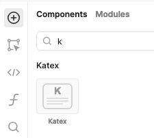

## Retool Custom Component Library - $KaTeX$

Use this to render [KaTeX](https://katex.org/) directly in Retool.

This library is a thin wrapper around the React Component: [react-katex](https://github.com/MatejBransky/react-katex)

To learn more about how custom component libraries work, visit our [official documentation](https://docs.retool.com/apps/guides/custom/custom-component-libraries).

### Library View

### Module View

### Inspector View

### Component View

